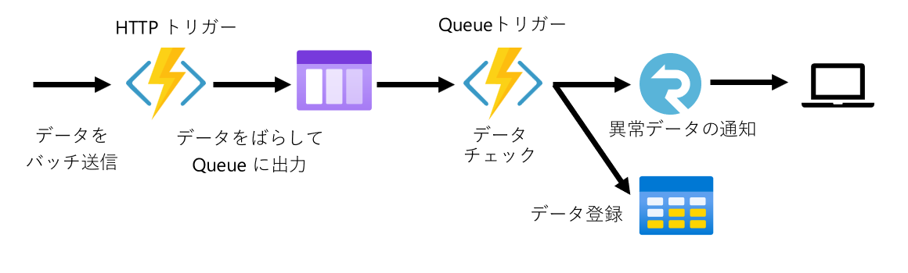

# Azure Functions のデモ アプリ

シンプルな Azure Functions のデモ アプリです。

Azure Fuctions の HTTP トリガーに送信されたデータを Azure Table Storage に保存します。
異常値を検知した場合は、Azure SignalR Service を経由してリアルタイムに監視用画面に送信します。



## 実行方法

Visual Studio 2022 での手順を記載します。

### 前準備

Azure SignalR Service を Serverless モードで作成して接続文字列を取得します。

DemoFunctionApp のシークレットマネージャーに接続文字列を保存します。

```json
{
    "AzureSignalRConnectionString": "接続文字列をここに貼り付けます"
}
```

DemoFunctionApp の template-localsettings.json を localsettings.json にリネームします。

### ローカルでの実行

1. AlertClient と DemoFunctionApp をマルチスタートアップで実行します。
2. AlertClient の画面で接続ボタンを選択して SignalR に接続します。
3. AddData.http を開いて Send Request を選択します。
4. AlertClient の画面でデータが表示されることを確認します。
5. Storage Explorer で Azure Table Storage にデータが保存されていることを確認します。
